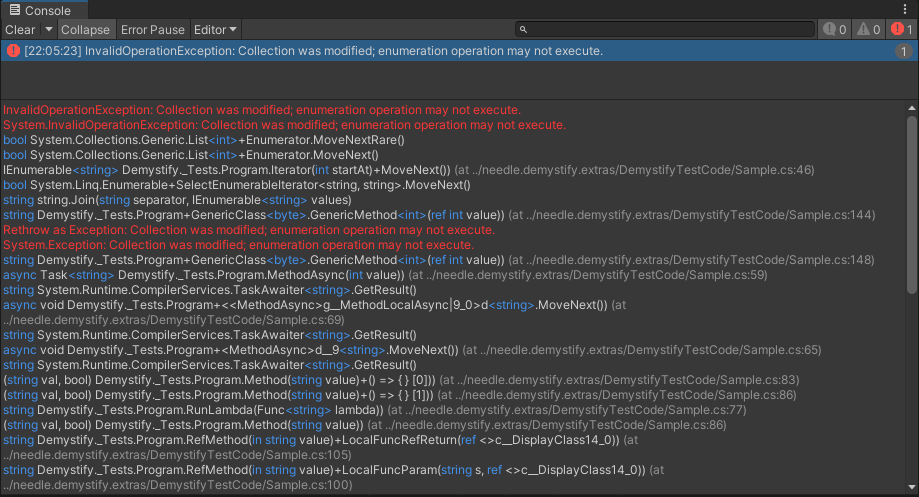
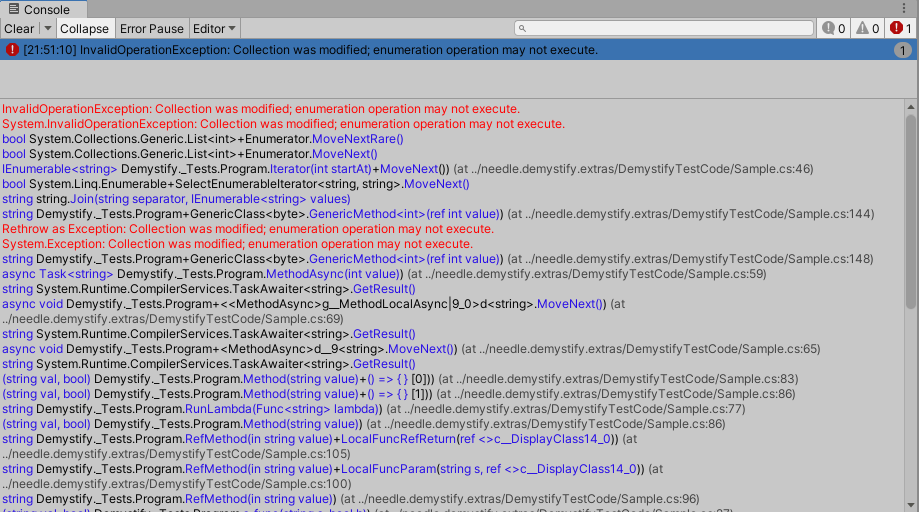

# Demystify for Unity
## High performance understanding for stack traces ⛷

This package brings [Ben.Demystifier](https://github.com/benaadams/Ben.Demystifier) to Unity.

A brief overview of what Demystifier does:

>.NET stack traces output the compiler transformed methods; rather than the source code methods, which make them slow to mentally parse and match back to the source code.  
Demystify outputs the modern C# 7.0 features in stack traces in an understandable fashion that looks like the source code that generated them.  
  
In a nutshell, all logs and exceptions will be made more understandable in the Unity Console.  
Syntax highlighting can be configured, and we're fixing some issues with source code links in packages along the way. Editor logs (that end up in the editor.log file) are also demystified.

## Quick Start ⚡️

After installation, by default all logs and exceptions will be demystified in the Console.  
Syntax highlighting will also be applied, and can be configured to your liking.  

Settings can be configured under ``Edit > Preferences > Needle > Demystify``. 

## Features 📜

### **Demystified Stacktraces** 🔮 for any log message and exceptions.  
  It *just works*, you don't need to do anything.  
  Logs going into Editor logfiles will also be demystified.  
  Runtime logs will _not_ be demystified (by design).

### **Syntax Highlighting** 🎨

We provide default syntax highlighting for Light and Dark Theme. You can also change colors to your liking.  
  Syntax highlighting comes with a slight performance impact when selecting a log (not when logging it).

- Adjust the highlighting colors to your liking.  
  
   

- Disable specific highlight types by setting the Alpha value of the respective setting to 0.

- Choose complexity of syntax highlighting
  
   
  *Types Only*

- Dark and Light Theme support
  
   

   

### **Fixes to source code links** 🧁  
  Sometimes, links to code in embedded/local packages don't work, so while we were at it we fixed that as well. (Case yyy for Unity people stepping by)

## Known Issues

- syntax highlighting has a performance impact, so if you're on a very slow machine you might want to turn it off (demystifying is highly optimized and shouldn't have a noticeable performance impact)

## Contact ✒️
<b>[🌵 needle — tools for unity](https://needle.tools)</b> • 
[@NeedleTools](https://twitter.com/NeedleTools) • 
[@marcel_wiessler](https://twitter.com/marcel_wiessler) • 
[@hybridherbst](https://twitter.com/hybridherbst)

[Demystifier by Ben Adams](https://github.com/benaadams/Ben.Demystifier)

