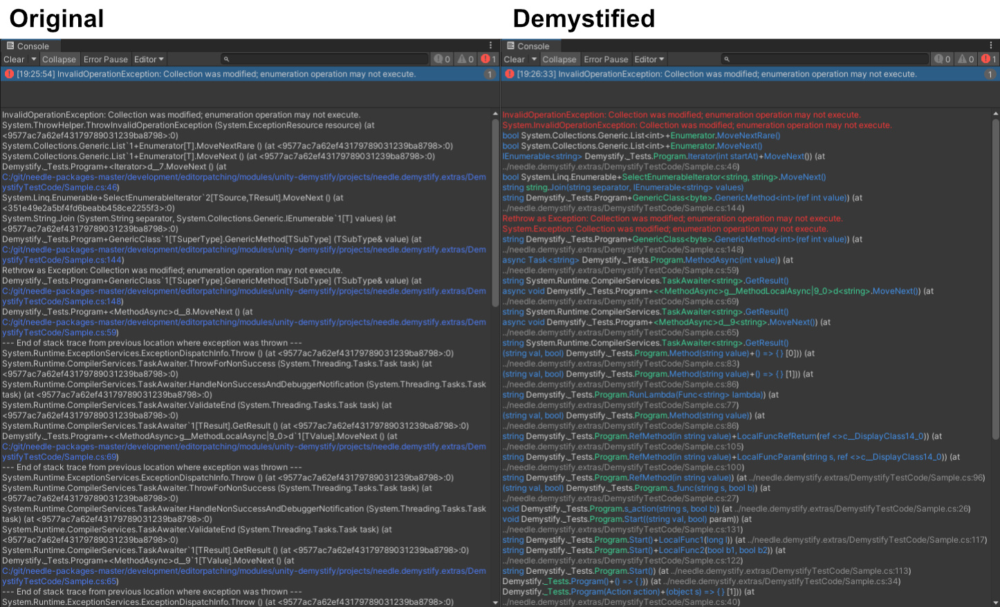

# Demystify for Unity
## High performance understanding for stack traces

This package brings [Ben.Demystifier](https://github.com/benaadams/Ben.Demystifier) to Unity

> .NET stack traces output the compiler transformed methods; rather than the source code methods, which make them slow to mentally parse and match back to the source code.

> ### Make error logs more productive
> Output the modern C# 7.0 features in stack traces in an understandable fashion that looks like the source code that generated them.

## Configureable

