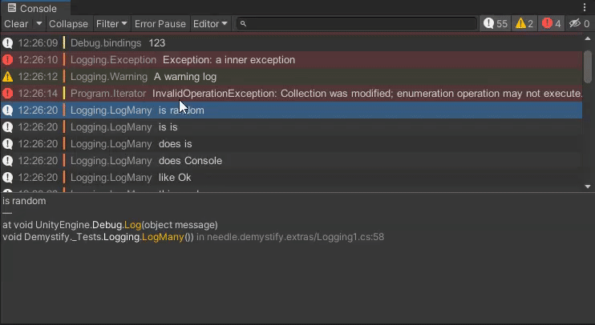
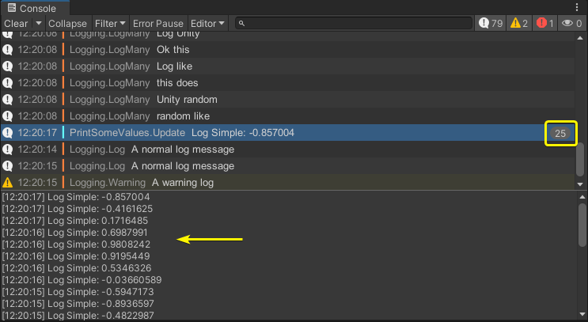
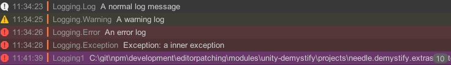
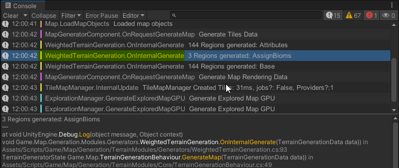

# Needle Console

## Better stacktrace readability, syntax highlighting, log filters, functional hyperlinks and more  

---

## **Feature Overview**  
- Improved stacktrace readability powered by [Demystifier](https://github.com/benaadams/Ben.Demystifier)
- Syntax-highlighted stacktraces
- Background colors by log type (e.g. warning, error, compiler error)
- Log prefixes and color-coding (only visually in editor)
- Filter logs: Hide or Solo logs by package, file, line, message...
- Collapse individual logs
- Ping script files from log
- Fully functional console hyperlinks
- Editor-only logs without impact on builds
- Fixes to source code links

 
## License  
Needle Console is [available on the Asset Store](https://assetstore.unity.com/packages/tools/utilities/needle-console-194002) for commercial use.  
Other versions are only allowed to be used non-commercially and only if you're entitled to use Unity Personal (the same restrictions apply).
  

## Quick Start ⚡️

<details>
<summary>Add from OpenUPM <em>| via scoped registry, recommended</em></summary>

This package is available on OpenUPM: https://openupm.com/packages/com.needle.console

To add it the package to your project:

- open `Edit/Project Settings/Package Manager`
- add a new Scoped Registry:
  ```
  Name: OpenUPM
  URL:  https://package.openupm.com/
  Scope(s): com.needle
  ```
- click <kbd>Save</kbd>
- open Package Manager
- click <kbd>+</kbd>
- select <kbd>Add from Git URL</kbd>
- paste `com.needle.console`
- click <kbd>Add</kbd>
</details>

<details>
<summary>Add from GitHub | <em>not recommended, no updates through PackMan</em></summary>

You can also add it directly from GitHub on Unity 2019.4+. Note that you won't be able to receive updates through Package Manager this way, you'll have to update manually.

- open Package Manager
- click <kbd>+</kbd>
- select <kbd>Add from Git URL</kbd>
- paste `https://github.com/needle-tools/console.git?path=/package`
- click <kbd>Add</kbd>
</details>

After installation, by default all logs and exceptions will be demystified in the Console.<br>
Syntax highlighting will also be applied, and can be configured to your liking.<br/>
Settings can be configured under ``Edit > Preferences > Needle > Console``.


## Features 📜

### **Demystified Stacktraces** 🔮 for any log message and exceptions
Logs going into Editor logfiles will also be demystified.  
Logs in builds will _not_ be demystified (by design).

>.NET stack traces output the compiler transformed methods; rather than the source code methods, which make them slow to mentally parse and match back to the source code.  
Demystify outputs the modern C# 7.0 features in stack traces in an understandable fashion that looks like the source code that generated them.

### **Stacktrace Syntax Highlighting** 🎨

We provide default syntax highlighting for Light and Dark Theme. You can also change colors to your liking.  
  Syntax highlighting comes with a slight performance impact when selecting a log (not when logging it).

- Adjust highlighting colors to your liking.
- Disable specific highlight types by setting the Alpha value of the respective setting to 0.
- Dark and Light Theme support


### **Log Filtering** 🔍
Log filters allow to hide specific logs in your project or only show the logs that matter for you right now. No need to change the way you write ``Debug.Log`` messages, it is all available at your fingertips via the console context menu.
- Hide logs by message, file, line, package or even time
- Solo logs: show only log entries that matter to you right now



### **Collapse individual repeating logs** 🍔
Multiple logs from the same source can be collapsed into a single log.  
Log history is preserved and can be seen in the stacktrace view when the log is selected.   
Prevent spamming your console - keep context visible  



### **Ping script** 📯
Right click a console log to ping the source script file  
Works with scripts in assets, embedded, local or registry packages


### **Console Hyperlinks** 🔗 
Console hyperlinks make logs with rich text usable and extendable.   
By default we provide handling for urls and files.  
Example to log a clickable link to Unity.com ``Debug.Log(<a href="www.unity.com">Open Unity Website</a>``   
Example to open a file somewhere on disc: ``Debug.Log(<a href="../project/relative/path.txt">Open some file</a>``

#### Custom Hyperlink Handling 🧷
To receive callbacks to hyperlinks you can use the ``HyperlinkCallback`` attribute.   
The method **must** be static. Either with return type **void** when you don't care if any other callback is executed as well or **bool** to control if other callbacks are called.   

The following example receives a callback when a link with ``<a href href="OpenNeedleConsoleSettings">`` in a log message is clicked and opens the Needle console preference window.
```csharp 
[HyperlinkCallback(Href = "OpenNeedleConsoleSettings")]
private static void OpenNeedleConsoleUserPreferences()
{
	SettingsService.OpenUserPreferences("Preferences/Needle/Console");
}
```


### **Log Background Colors** 🚦
- Log background colors can be enabled or disabled to show the severity of a log.  
- Compiler errors receive special treatment and are rendered magenta so that shader programmers will feel right at home (it's great, really!)

 


### **Log prefixes** 📍
Logs can automatically be prefixed with file- and method-name providing more context at your log output at a glance. Additionally we add a colored bar in front of the log message that shows which logs belong together / come from the same file.



### **Editor Only logs** 📑
Use ``DebugEditor`` methods to log messages **only** in Unity Editor.   
No garbage or cpu cycles will be wasted in your standalone application.  
It is also possible to implement a class named ``DebugEditor`` somewhere in your code to add custom functionality.  
**NOTE**: Double clicking log entries that contain ``DebugEditor.Log`` in the console will still open the right file for you.  


### **Fixes to source code links** 🧁  
  Sometimes, links to code in embedded/local packages don't work, so while we were at it we fixed that as well. (Case 1304954 for Unity people stepping by) [Issue Tracker](https://issuetracker.unity3d.com/issues/script-file-that-references-package-script-is-opened-when-double-clicking-a-console-message-in-editor-that-comes-from-a-package)

## Known Issues 🩹

- syntax highlighting has a performance impact, so if you're on a very slow machine you might want to turn it off (demystifying is highly optimized and shouldn't have a noticeable performance impact)


## Contact ✒️
<b>[🌵 needle — tools for unity](https://needle.tools)</b> • 
[@NeedleTools](https://twitter.com/NeedleTools) • 
[@marcel_wiessler](https://twitter.com/marcel_wiessler) • 
[@hybridherbst](https://twitter.com/hybridherbst)

[Demystifier by Ben Adams](https://github.com/benaadams/Ben.Demystifier)

